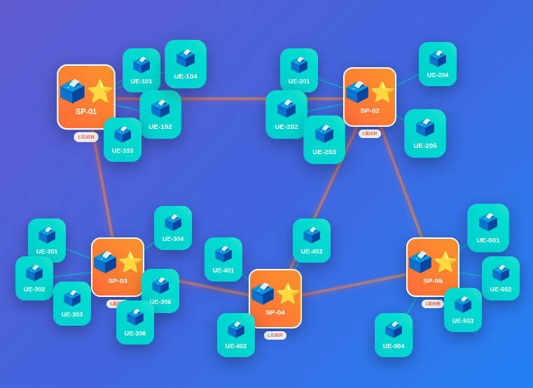

# 🗳️ SD-Eleição

Projeto aberto da disciplina de Sistemas Distribuídos - 2025Q2, implementando uma apuração distribuída de votos de urnas eletrônicas em uma rede Superpeer.



*Figura: Arquitetura Superpeer utilizada no sistema.*

## 🔧 Tecnologias
Java, Apache ZooKeeper

## 🚀 Metodologia

O sistema simula a apuração de uma eleição distribuída em uma arquitetura de rede Superpeer, onde urnas eletrônicas são organizadas em grupos regionais. Cada grupo possui múltiplas urnas (nós comuns) e um Superpeer, eleito dinamicamente entre as urnas do grupo para coordenar a apuração regional.

**Como funciona:**

- **Envio e sincronização dos votos:**  
  Cada urna envia seu Boletim de Urna (BU) para uma fila regional. Barreiras distribuídas garantem que todas as urnas do grupo estejam sincronizadas antes de iniciar a apuração.

- **Eleição de líder (Superpeer):**  
  Após a sincronização, as urnas participam de uma eleição. O vencedor torna-se o Superpeer, responsável por coletar todos os BUs do grupo, consolidar os votos e publicar a apuração regional.

- **Auditoria distribuída:**  
  Todas as urnas do grupo, incluindo o Superpeer, auditam a apuração regional. Caso alguma urna detecte inconsistências, um alarme é registrado para investigação.

- **Consolidação da apuração total:**  
  O Superpeer, após a auditoria, atualiza a apuração total do sistema, utilizando exclusão mútua para garantir que apenas um líder regional faça alterações por vez.

## 📦 Execução

Para rodar o `UrnNodeApplication`, siga os passos abaixo:

---

### **1. Compilação do Código**

Certifique-se de que todas as dependências estão na pasta `lib` (Gson, ZooKeeper, SLF4J, etc.).

#### **Linux/macOS:**
```sh
javac -cp "lib/*" UrnNodeApplication.java common/*.java
```

#### **Windows CMD:**
```bat
javac -cp "lib/*" UrnNodeApplication.java common\*.java
```

---
### **2. Inicialização do ZooKeeper**

Inicie o ZooKeeper antes de rodar a aplicação:

#### **Linux/macOS:**
```sh
zkServer.sh start
```

#### **Windows CMD:**
```bat
zkServer.cmd
```

---
### **3. Execução da Aplicação**

Escolha um arquivo de configuração (ex: `urn1.config.json` ou `urn2.config.json`):

#### **Linux/macOS:**
```sh
java -cp ".:lib/*" UrnNodeApplication urns/urn1.config.json
```

#### **Windows CMD:**
```bat
java -cp ".;lib/*" UrnNodeApplication urns\urn1.config.json
```

Você pode rodar múltiplas instâncias (em terminais separados) com diferentes arquivos de configuração para simular várias urnas.


